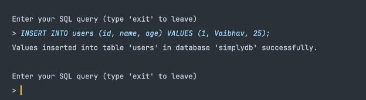

# SimplyDB

A Prototype of a light-weight RDBMS using Java programming language 

## Design of the application 

Let’s go over the design of the application. I will be covering the birds eye view of the application. To understand the control flow, we will need to understand the components.  

I have added 4 layers in our DBMS application: 

1. I/O Layer 
1. Query Processor Layer 
1. Data Control Layer 
1. Data Layer 

Figure 13: design of custom DBMS  

Let’s go over each component and cover briefly what it does and why it’s there. 

**I/O Layer** 

This layer is responsible for take input SQL query from the user and showing the output of the query to the user. The user will be interacting with this layer. This layer is also responsible for passing the data (query) to the other components. 

Figure 14: I/O Layer 

**Query Processor Layer** 

Query Processor is responsible for parsing the validating the query. Once the query is validated the query is then parsed and after that processed. Order is defined below: 

1. Validate SQL Query (syntax) 
1. Parse SQL Query 
1. Process SQL Query 

Validate SQL Query (syntax) 

At this point I validate the syntax of the SQL query. I am validating the query using the Regex pattern for the supported DDL and DML. 

Parse SQL Query 

I will be parsing the SQL query to get the values specific to the query. For example, *SELECT \* from users* 

I will parse the query and return table and the columns to fetch from the database. This will be used by the next layer to process the query. 

Process SQL Query 

This is the control plane for the query and here I have the actual logic to process query. This will do the operation on the database based on the query type and the values passed in the query. 

Note, this does not directly talk to the database but uses abstract methods to interact with database, which I will cover in the next layer. 

Figure 15: Query Processor Layer 

**Data Control Layer** 

This layer is responsible for the talking to the database. This layer provides abstraction over manipulating the database file. This layer is responsible for reading, writing, locking a file. For the case if the encryption at rest is enabled it also responsible for encrypting the data when writing to the disk. And decrypting the data when reading from the disk. 

This is layer also has an important role for the internal working of the DBMS. As I  create metadata for database and table using the abstraction offered by this layer. 

Responsibilities: 

1. Create Database 
1. Read Database 
1. Create Database Metadata 
1. Read Database Metadata 
1. Update Database Metadata 
1. Create Table 
1. Read Table 
1. Create Table Metadata 
1. Read Table Metadata 
1. Update Table Metadata 
1. Encrypt/Decrypt Data 
1. Hash Data 

Figure 16: Data Control Layer 

**Data Layer** 

Data layer is the actual database where the database and tables live. I am using directories or folder for actual database and tables in our DBMS. 

The folder structure of the database and tables is show below 

Figure 17: Database and Table directory structure 

The database metadata file and table metadata file are used by the DBMS internally to reference the correct database and table. It also stores details about the datable like columns, data types of the columns, order of values stored in the table. 

Figure 18: Data Layer 

**Design of the DBMS application** 

The full design as per the above discussed components is shown below. 

Figure 19: DBMS design overview 

Authentication 

I am using **username**, **password** and **captcha** for authentication. I have added a few users (username and passwords) to a text file, acting as a database table. This database table is located in the admin database. I am hashing the password on the file using the **SHA-256**. 

Username and password are read and authenticated on the DBMS users’ table. The captcha is generated at runtime and validated on login. 

Figure 20: Successful Login for our DBMS 

Figure 21: DBMS users database table with hashed password 

Figure 22: DBMS user Auth design 

Design of Persistent Storage 

I am using the directories or folder with text files to persist our storage. I am also using the metadata files for database and tables to track internal details to store database and table specific details. 

Data to the file is written with a custom delimiter (**“:”**). The values are joined with the delimiter to form a text string and written to a file. The order is in which each value is joined in the structure is important for me as I am using index-based retrieval for the values. The mapping of the index to the value is stored on the metadata file. 

Figure 23: Encrypted user data persisted on the text file 

Figure 24: Table metadata for the users table 

Figure 25: Database metadata file 

Figure 26: Database tables metadata file to track all tables in a DB 

Implementation of Queries (DDL & DML) 

I have implemented the following SQL commands: 

1. CREATE TABLE
1. INSERT
1. SELECT 

Create Table 

I have implemented the CREATE TABLE SQL command. I am following the SQL CREATE Table command structure for the command. For a successful execution this will result in creating database table. 

Insert 

I have implemented the INSERT SQL command. I am following the SQL INSERT command structure. For a successful execution this will insert the data to the specified table in the current database. 

Select 

I have implemented the SELECT SQL command. I am following the SQL Select command structure. For a successful execution this command will return all the values from the table. I can also pass particular columns or a wildcard charter to fetch all the columns. 

I have also implemented WHERE clause for the SELECT query. This will only handle the simple operation and only supports equality operator. 

Implementation of Transact 

I have implemented the SQL Transaction.  

1. Start/Begin Transaction 
1. Commit 
1. Rollback 

Start/Begin Transaction 

SQL Command to start or begin the transaction. In my DMBS I support both START TRANSACTION and BEGIN TRANSACTION keywords to start the transaction. 

Commit 

SQL Command to commit the queries from buffer to disk. 

Rollback 

SQL Command to flush the buffer and reset the buffer. 

**Design of Transaction** 

To handle Transaction, I have a buffer and Transaction status. Components: 

1. Buffer 
1. Transaction Status 

Buffer 

This will store all the queries that are executed during the transaction. 

Transaction Status 

A flag to track if the transaction is in progress or not. 

*Control Flow* 

When a user starts the transaction, the queries that a user enters after that goes through the validation layer and then to the buffer which is a Linked list instead of directly being processed and executed on the disk. 

Figure 27: Start Transaction flow 

Figure 28: Commit Transaction flow 

Figure 29: Rollback Transaction flow

Testing our DBMS 

Authentication 

Test: User enters correct username and password Expect: User should be logged in successfully 

Figure 30: Successful login 

Test: Login Failure wrong password 

Expect: User should get a Login failure message due to invalid credentials 

Figure 31: Login failure due to wrong password 

Test: Login Failure wrong captcha 

Expect: User should get a Login failure message due to captcha 

Figure 32: Login failure due to wrong captcha 

Create Table 

Test: Successfully creates a table Expect: Table should be created table 

Figure 33: Creates users table 

Test: Fails to create a table due to bad query Expect: User should get an Invalid query error 

Figure 34: Bad query for create table 

Insert into Table 

Test: Successfully inserts data to the table in database Expect: Data to be successfully inserted 

Figure 35: Successfully insert data to table 

Test: Fails to insert data in table due to bad query Expect: User should get Invalid query Error 

Figure 36: Bad query for insert into table 

Select values from Table 

Test: Successfully fetches data from the specified table for wildcard character Expect: User should be able to fetch the inserted values 

Figure 37: Show the data from select with wildcard character 

Test: Successfully fetches data from the specified table for selected columns Expect: User should get only the selected columns in the output 

Figure 38: Show the data for specific columns 

Test: Successfully fetches data from the specified table with a where clause Expect: User should get the filter data as per the where clause 

Figure 39: Show the data from select with where clause 

Test: Should fail for an invalid query 

Expect: User should get an Invalid query error 

Figure 40: Throws error for invalid table name in select query 

Transaction 

Test: Should be able to start and commit a transaction 

Expect: User should be able to see the changes persistent in the database 

Figure 41: Start and commit a transaction 

Test: Should be able to start and rollback a transaction 

Expect: User should be able to see that their changes are not persisted to database. 

Figure 42: Start and rollback a transaction 

Test: Should throw when we start a transaction within a transaction Expect: User should get an Invalid transaction error 

Figure 43: Throws error for invalid start in transaction 

Test: Should throw when we rollback a transaction that has not started Expect: User should get an Invalid transaction error 

Figure 44: Throws error for invalid rollback in transaction 

Test: Should throw when we commit a transaction that has not started Expect: User should receive and Invalid transaction error 

Figure 45: Throws error for invalid commit in transaction  
41
